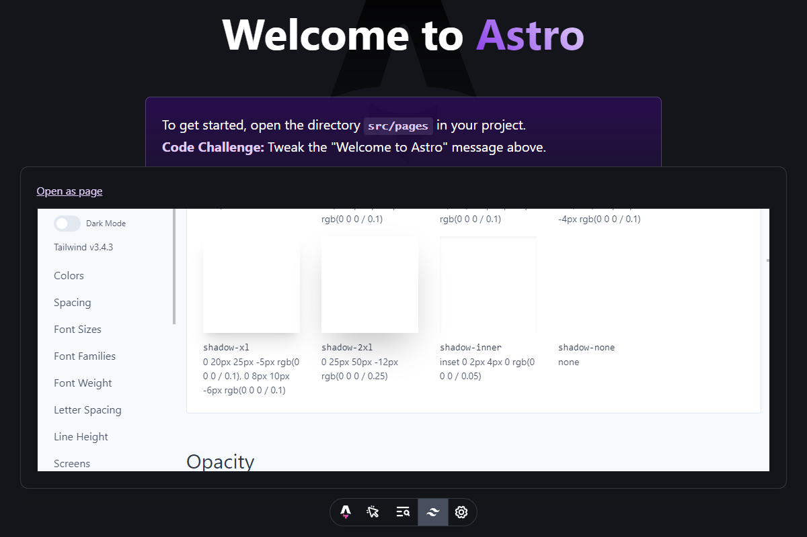

# Tailwind config viewer for Astro

`astro-tailwind-config-viewer` is an integration that adds [`tailwind-config-viewer`](https://github.com/rogden/tailwind-config-viewer) during development.

> requires a minimum Astro version of 4.7

To see how to get started, check out the [package README](./packages/astro-tailwind-config-viewer/README.md)

## Licensing

[MIT Licensed](./LICENSE). Made with ❤️ by [Florian Lefebvre](https://github.com/florian-lefebvre).
